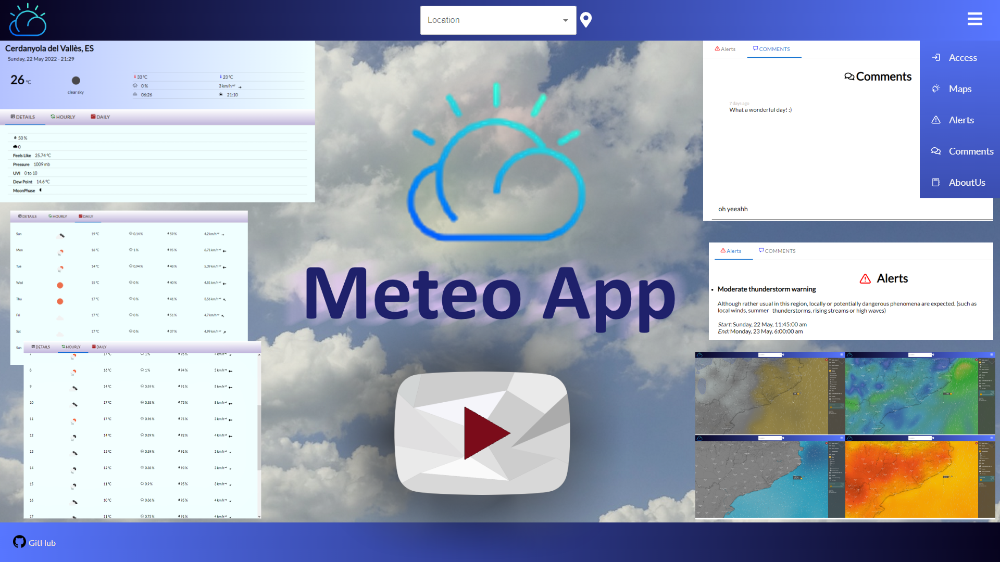

# App Meteo

## Introducción

 Este es un proyecto de fin de estudios de Grado Superior, en IES Badia, y la duración estimada sería de 99h, en un plazo del mes de MAyo de 2022. Luego se consideraría concluido. 

## Descripción

 Nuestro objetivo es crear una aplicación meteorológica donde los usuarios obtengan toda clase de información climática útil sobre el día y los posteriores de la semana. Además, existirá un área de feedback dónde se recibirán alertas con las descripciones de los fenómenos que estén ocurriendo y se
podrá comentar en las previsiones, así debatiendo sobre cada una de estas.

## Instalación

### Requisitos
-  <a href='https://nodejs.org/download/release/v14.17.3/'>Node.js - version {14.17.3}</a> 
- Yarn - version {1.22.17}
-  <a href='https://git-scm.com/download/win'>Git</a>
-  <a href='https://github.com/CyohProject'>Repositorio del proyecto</a> 

### Entornos Windows

 Nuestro proyecto se ejecuta bajo el entorno de ejecución de Node.js, en concreto utilizamos la versión  <a href='https://nodejs.org/download/release/v14.17.3/'>14.17.3</a>. Descargamos e instalamos. Dejamos que él mismo configure las variables de entorno para poder ejecutar comandos en terminal. 

 A continuación, instalaremos la herramienta Git para conectar con el repositorio de proyecto en Github y, además, obtenemos una terminal Bash que nos permitará ejecutar utilidades de Node y comandos linux.  Vamos a la página oficia de <a href='https://git-scm.com/download/win'>Git</a>
Una vez lo tengamos, vamos a obtener el proyecto. Podemos hacerlo de 2 maneras:  

<ul>
<li><b> Descarga directa en formato zip: </b> </li>
<ul>
	Accedemos al enlace en nuestro repositorio de github <a href='https://github.com/CyohProject'>CyohProject/meteo-app</a> y descomprimimos el fichero en la ubicación que deseemos. 
	</ul>
<li><b> Descarga directa en formato zip: </b> </li>
<ul>
	<li> Primero creamos una carpeta en el lugar que escojamos y, clic derecho en el ratón, abrimos una terminal Git Bash </li>
	<li> Allí escribimos el siguiente comando: <i> git clone https://github.com/CyohProject/meteo-app.git .</i></li>
	<li> Se descargará el contenido del repositorio dentro de la carpeta dónde se abrió el terminal.</li>
	</ul>
</ul>

 Ahora instalaremos Yarn, un gestor de paquetes y dependencias de Node, el cual nos ayudará a instalar las dependencias, ejecutar, construir, testear… el proyecto. En la misma terminal, escribimos:
<ul> <i> npm install --global yarn </i> 
 </ul>

 Por último, vamos a instalar las dependencias necesarias para poder utilizar nuestro proyecto. Estas se almacenan en el directorio node_modules. En los ficheros package.json están guardadas las librerías, diferentes scripts y configuraciones. A través de la terminal y el comando 
<ul> <i> yarn install </i> 
 </ul>

 Una vez hecho todo ésto, ya tenemos el proyecto preparado para ejecutarse a nivel de desarrollo. Utilizaremos 2 terminales, una para ejecutar primero el back end y otra el front: 

<ul> <li> <strong>Back end</strong>: <i> cd api && yarn start </i> </li> </ul> 
<ul> <li> <strong>Front end</strong>: <i> cd api && yarn start </i> </li> </ul> 

## Colaboradores

 Lorenzo García 

 Oriol Salvador 

 Jose María Molero 

